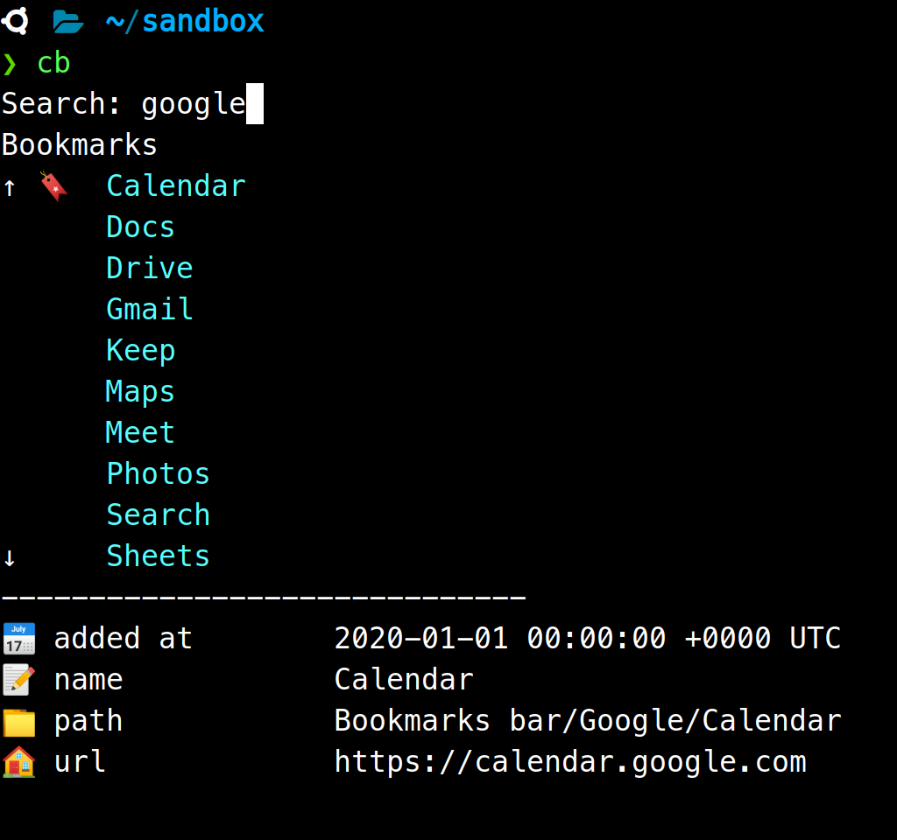

<p align="center">
  <a href="https://github.com/skmatz/cb">
    
  </a>
</p>

<p align="center">
  <a href="https://github.com/skmatz/cb/actions?query=workflow%3Abuild">
    
  </a>
  <a href="https://github.com/skmatz/cb/actions?query=workflow%3Arelease">
    
  </a>
  <a href="./LICENSE">
    
  </a>
  <a href="./go.mod">
    
  </a>
  <a href="https://github.com/skmatz/cb/releases/latest">
    
  </a>
</p>

<p align="center">
  
</p>

# cb

:bookmark: Chrome bookmarks from terminal

**cb** is an interactive CLI to open Chrome bookmarks from the terminal.  
Just run `cb` and you can search for Chrome bookmarks and open in your browser.

## Usage

Basically you just run the command.  
Note that Windows users cannot use arrow keys to move due to [this issue](https://github.com/manifoldco/promptui/issues/49), so type "?" to switch the search mode and use "j" or "k" keys like Vim to move up or down.

## Install

### Binary

Get binary from [releases](https://github.com/skmatz/cb/releases).  
If you already have [jq](https://github.com/stedolan/jq) and [fzf](https://github.com/junegunn/fzf) or [peco](https://github.com/peco/peco), you can download binary by running the following command.

```sh
curl -Ls https://api.github.com/repos/skmatz/cb/releases/latest | jq -r ".assets[].browser_download_url" | fzf | wget -i -
```

### Source

```sh
go get github.com/skmatz/cb
```
